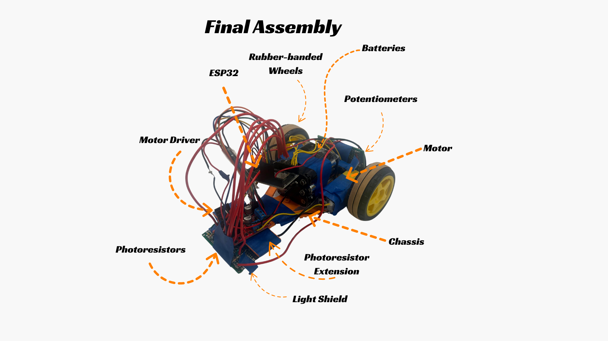

Arjun Caputo, Carlos Briones, Brian Martinez, Hieu Le

---

## Project Overview

McLaren Papaya Highlight

This project is our final project for ECE 5. This project combines our (basic) knowledge of hardware, software, and embedded systems to create a basic line following robot. In the end, we will compete against other teams in our class to see how our robot performs. Stay tuned for more updates!

## Hardware and Software

Aero Blue Highlight

### BOM:
- 1 ESP32 Dev Board
- 3D Printed Parts
 - Chassis, Light Shield, Photoresistor Mount, Motor Cover
- 1 Caster Wheel
- 1 L298N Motor Driver
- LEDs
- 2 DC Motors
- 2 Wheels
- 2 Breadboards
- 9V battery connector
- 4 Potentiometers
- 7 !0k Ohm Resistors
- 7 Photoresistor
- 1 9V Battery

### Control
We use a basic PID loop to tune our line following. PID is a basic feedback control system that uses three components to account for error in our robot. There are three terms: kP, kI, and kD, which we tune to get our robot to turn smoothly. 

The kP term is proportional to the error itself, so if we have a larger error, we expect a larger correction. High kP values can be useful for quick response time, but it may cause lots of overshoot. 

The kD term is proportional to the change in error over time. This means as we get closer to our target, we slow down, so that we don't overshoot our target as much. Similarly, if we are getting further from our target, we get a greater correction.

The kI term is proportional to the summation of all the system's error over time. This can be useful if we have steady-state error (if we are consistently offset from our goal).

**Our final PID values**
kP: 10
kI: 0
kD: 4

## Initial Assembly

  
  

## Final Assembly

  

## Initial Line Following

<video src="https://github.com/user-attachments/assets/4393dc19-ba48-421d-a165-e064f0209940" controls style="max-width:100%; border-radius:10px; box-shadow:0 4px 12px rgba(0,0,0,0.2);"></video>

## Poster

## Competition Results

## Competition Video

## Improvements

