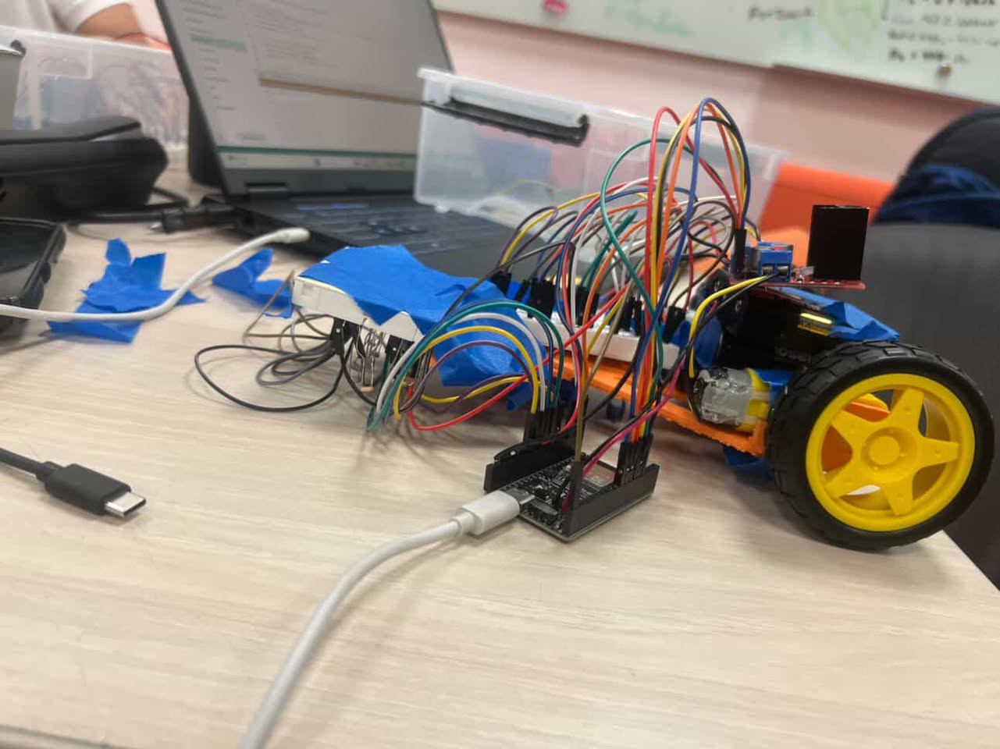
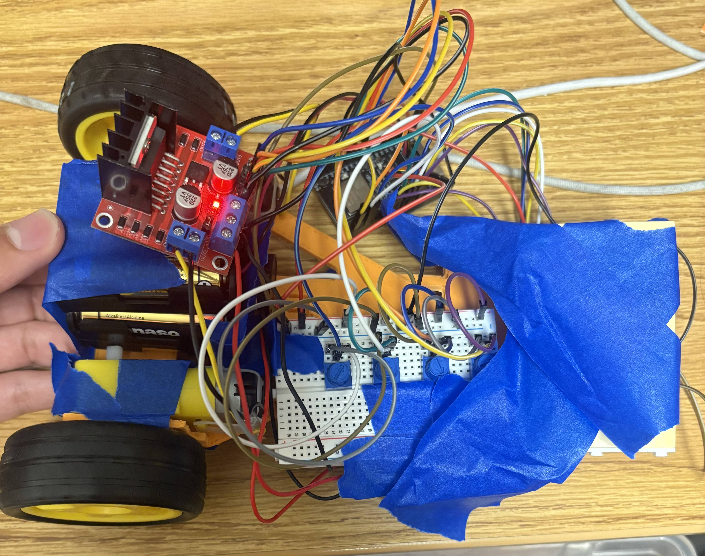

Arjun Caputo, Carlos Briones, Brian Martinez, Hieu Le

---

## Project Overview

McLaren Papaya Highlight

This project is our final project for ECE 5. This project combines our (basic) knowledge of hardware, software, and embedded systems to create a basic line following robot. In the end, we will compete against other teams in our class to see how our robot performs. Stay tuned for more updates!

## Hardware and Software

Aero Blue Highlight

### BOM:
- 1 ESP32 Dev Board
- 3D Printed Parts
 - Chassis, Light Shield, Photoresistor Mount, Motor Cover
- 1 Caster Wheel
- 1 L298N Motor Driver
- LEDs
- 2 DC Motors
- 2 Wheels
- 2 Breadboards
- 9V battery connector
- 4 Potentiometers
- 7 !0k Ohm Resistors
- 7 Photoresistor
- 1 9V Battery

### Control
We use a basic PID loop to tune our line following.

## Initial Assembly

  
  

